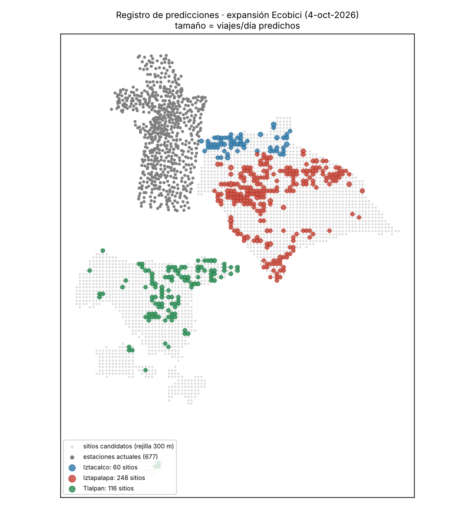

# ecobici-red-cdmx

*[Versión en español](README.es.md)*

**Designing Mexico City's bike-share network with censored demand, plus a public pre-registered forecast for the 2026 expansion.**

In August 2026 Mexico City's Mobility Secretariat (SEMOVI) announced that Ecobici will grow from 687 to
1,111 stations (+424) and from 9,308 to 15,000 bikes, reaching the boroughs of Iztapalapa, Iztacalco and
Tlalpan. Using only public data, this project asks: where should those stations go, and how many docks and
bikes should each one get? Most importantly, it **registers the predictions before the stations open**, so
they can be checked against real trips later.

## Pre-registered forecast · October 4, 2026

| Borough | Sites | Docks | Bikes | Trips/day · site model | Trips/day · 2017 Household Travel Survey anchor (low – mid – high) |
| --- | --- | --- | --- | --- | --- |
| Iztapalapa | 248 | 6,728 | 3,345 | 18,754 | 17,031 – 33,962 – 36,326 |
| Iztacalco | 60 | 1,686 | 835 | 4,692 | 4,693 – 9,358 – 10,009 |
| Tlalpan | 116 | 3,038 | 1,508 | 8,470 | 2,159 – 4,305 – 4,605 |

- Site-level predictions with 80% intervals: [`registro/registro_predicciones_2026-10-04.csv`](registro/registro_predicciones_2026-10-04.csv)
- Assumptions and validation protocol: [`registro/registro_predicciones_2026-10-04.json`](registro/registro_predicciones_2026-10-04.json)
- SHA-256 of the CSV: `46140e98aea343dce4ad729e7b517843dca48f7a35e7dadbf6aaa5fde217f45b` ([`registro/SHA256SUMS`](registro/SHA256SUMS)), sealed in release [`registro-2026-10-04`](../../releases/tag/registro-2026-10-04)

Verify the file has not changed: `python scripts/verificar_registro.py`

**Main hypothesis:** the site model and the travel survey disagree (Tlalpan: the model is twice the survey;
Iztapalapa: the survey is almost twice the model). Real data will show which anchor is more useful for
planning in areas with no bike-share history.

**How it will be validated:** once new stations appear in the live feed and in the monthly open data,
(1) per borough, real trips/day against both anchors; (2) per real station, the prediction of the nearest
registered site (<300 m): 80% interval coverage and demand captured by the top 20%; (3) comparison against a
simple rule (proximity to Metro/Metrobús + bike lane). True demand at new stations will be measured
correcting for censoring (time spent empty or full) using the station-status capture in this repository.



## Station-status capture

[`.github/workflows/captura_gbfs.yml`](.github/workflows/captura_gbfs.yml) stores the status of every station
(bikes available, disabled, free docks) roughly every 5 minutes in the `gbfs-archive` branch, and logs every
station opening, closure or capacity change in `info/cambios.csv`, so the opening date of each new station is
recorded. GitHub does not guarantee exact timing; occasional delays and gaps are expected.

## Results so far

| Stage | Finding |
| --- | --- |
| Reconstruction (Jan–Sep 2026) | 13.9 M trips; ~3,900 bikes rebalanced by truck per day, reconstructed from each bike's trip chain. |
| Censored demand | Observed pickups 50,832/day; estimated demand 53,793/day (+5.8%); lost pickups 370–4,141/day. |
| Site ranking (spatial cross-validation) | Gradient boosting captures 28.8% of demand with the top 20% of sites, same as a simple rule (29.0%); oracle 38.7%. |
| 2023→2024 expansion wave (120 stations) | Model 28.9% vs. simple rule 27.6% (difference not significant). Models under-predicted new-station demand by 12–21% → level correction factor 1.198. |

Honest reading: ranking corner by corner does not beat a simple rule. The value lies in sizing (censored
demand, level correction, intervals) and in allocation across areas.

## Method

1. **Bike trip chains** (`src/chains.py`): if a trip ends at A and the same bike's next trip starts at B ≠ A,
   the bike was relocated. This yields bounds on each station's inventory every 10 minutes.
2. **Censored demand** (`run_censored.py`): pickups are counted only when a bike was surely available, and
   returns only when a dock was surely free; station × hour rates with a hierarchical Gamma-Poisson model.
   Adapts the endogenous-censoring treatment from the undergraduate thesis *Diseño y evaluación de una política
   de reposición multiproducto sensible a liquidez para nanostores* (Gamón Guerrero & Macías Herrera, UNAM, 2026).
3. **Context** (`src/context.py`): 2020 Census by block group (AGEB), DENUE business directory, GTFS, bike lanes.
4. **Retrospective test** (`run_wave.py`) and **allocation** (`run_allocation.py`): greedy selection of 424
   sites at least 300 m apart; docks and bikes proportional to level-corrected demand.

## Reproduce

Python 3.11+ with pandas, numpy, scipy, scikit-learn and matplotlib. Raw data is not included; place it in
`data/` (or set `ECOBICI_DATA`):

- `data/*.csv` and `data/viajes_2026/*.csv`: monthly trips from [Ecobici open data](https://ecobici.cdmx.gob.mx/datos-abiertos/)
- `data/station_information.json`: [Ecobici GBFS](https://gbfs.mex.lyftbikes.com/gbfs/gbfs.json)
- `data/contexto/`: GTFS, former-system stations, current stations, bike infrastructure and 2020 Census by AGEB from [Mexico City Open Data](https://datos.cdmx.gob.mx/); [DENUE](https://www.inegi.org.mx/app/descarga/) and the [2017 Household Travel Survey (EOD)](https://www.inegi.org.mx/programas/eod/2017/) from INEGI

```bash
python tests/test_chains.py
python run_phase0.py --raw data/viajes_2026 --stations data/station_information.json --out out/phase0_jan_sep
python run_context.py && python run_wave.py && python run_censored.py && python run_allocation.py
```

## Credits and related work

- [Jero110/movilidad-cdmx](https://github.com/Jero110/movilidad-cdmx): operational Ecobici rebalancing with a MILP assigner; this project addresses network design, not daily operations.
- [MaxHalford/bike-sharing-history](https://github.com/MaxHalford/bike-sharing-history): historical station-status archive.
- Data from Ecobici, Government of Mexico City, and INEGI. Code under the MIT license.
